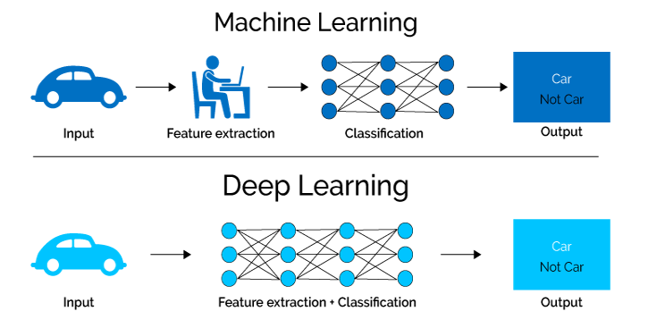
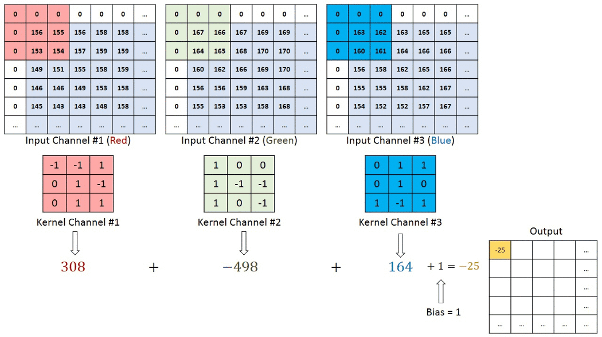

# PYCK PROJECT
# AGE-GENDER DETECTION (PYTHON-OpenCV-DNN)
## Introduction
Online search, shopping, payments, entertainment, social media, and many other technologies came into existence in the past 15-20 years. But it is observed that in the last 5 -6 years, companies are investing heavily in computer vision and machine learning technologies. But why? 
<br />
<br />
To know the needs and requirements of their user and customers more and more. And the more they fulfill their requirements, the more they build customer’s trust and loyalty. Computer vision can be used in securities, traffic control, self-drawing cars, etc. One can do hundreds of things using computer vision: object detection, face detection, age and gender detection, path detection, and many more. Among them, face detection is most valuable and uncomplicated. It is used in apps like Snapchat, identifying criminals in a crowd, security and video surveillance, and privacy of our smartphones. 
<br />
<br />
In this project, We have used Computer vision using Python-OpenCV and DNN. We implement CNN, Deep learning approaches, and OpenCV using Python to achieve robust age group and gender classification of faces. We used a dataset for face photos that include various real-world imaging conditions like noise, lighting, pose, and appearance. We classified people into male and female and different age groups. We have used various online materials for learning about this and implementing it in the most reliable way possible. 
<br />
<br />
## Concept and Framework Used 
### Deep Learning:
Deep learning is a subset of machine learning. It uses the multilayered structure of the algorithm called Neural network. The design of NN is based upon the human brain. With the help of NN, we can perform various machine learning tasks like classification, regression, clustering. Deep learning is also different from SVM and Naive-Bayes classifier methods because it doesn’t require feature extraction to classify data into several categories.


<p align="center">

</p>

### Convolutional Neural Network:
We used CNN in our project. We input our image in this algorithm, and then it assigns important features and weight to various parts in a snap. This feature differentiates objects in an image. ConvNet successfully captures spectral and temporal characteristics. It performs better than other algorithms due to the reduction of parameters and reusability of weights. CNN uses kernels that extract the features from an image. It traverses through the whole image generating a convoluted feature output. There can be multiple layers in this arrangement, each used to extract different features. After that, the pooling layer is used to reduce the spatial size of convolved features. It reduces dimensionality by extracting only necessary features, which results in decreases in the computational power required. There are two possible ways to apply the pooling layer. Max-pooling returns the max value from the portion kernel covers, while average pooling returns the average value.

<p align="center">

</p>

### OpenCV-Python: 
We have also used OpenCV-Python in our project. OpenCV (Open Source Computer Vision Library) is an open-source computer vision and machine learning software library. Using OpenCV, we can identify real-time faces, objects, and even handwriting. OpenCV-Python is a library/API in python language which is used to implement various computer vision tasks. It is written in C/C++, which makes it very fast, and the interface of Python makes it easy to code and deploy. OpenCV supports much deep learning frameworks like Caffe, Tensorflow, And PyTorch. When working with Caffe models, we should have two sets of files. They are 
* .prototxt - contain  model architecture(Layers)
* .caffemodel - contain weights for the actual layer

## Our Implementation
### Face Recognition:
Face detection can be divided into three steps
1. Face detection — Detecting one or more faces in an image.
2. Feature extraction — Extracting the essential features from an image of the face.
3. Face classification — Classifying the face based on extracted features.

OpenCV’s face detector is based on the single-shot detector(SSD) framework. It requires two file types, Caffe prototxt files, and Caffe weight files, explained above. First, we input an image or video frame to our face recognition pipeline. Then we apply face detection to identify the location of faces in the image. Then after computing facial landmarks, it processes and aligns the face. Face alignment includes identifying the geometric structure of faces and obtaining a canonical alignment of the face based on transition, rotation, and scale. After alignment and cropping, we pass the input face into our deep neural network. 
The FaceNet deep learning model computes a 128-d embedding that quantifies the face itself. FaceNet is a deep neural network used for extracting features from an image of a person’s face. FaceNet takes an image of the person’s face as input and outputs a vector of 128 numbers representing the most important facial features. In machine learning, this vector is called embedding. Why embedding? Because all the essential information from an image is embedded into this vector. FaceNet takes a person’s face and compresses it into a vector of 128 numbers. Ideally, embeddings of similar looks are also identical. It is computed by training a face recognition model with deep learning. Each input data includes three images.

1. The anchor - current face
2. The positive image - this also contains the image of a person
3. The negative image - It is the image of some other person

The neural network computes the 128-d embeddings for each face and then tweaks the weights of the network (via the triplet loss function) such that
1. The 128-d embeddings of the anchor and positive image lie closer together
2. While at the same time, pushing the embeddings for the negative image father away

<p align="center">

</p>

In training, the neural network learns to output similar vectors for faces that look similar. After training the network, the network learns to output the vector that is closer to each other.

### Gender and Age Detection:
Our Age and Gender detection are based on a model trained by [Gil Levi and Tal Hassner](https://talhassner.github.io/home/projects/cnn_agegender/CVPR2015_CNN_AgeGenderEstimation.pdf). They used CNN similar to CaffeNet. The network uses three convolutional layers, two fully connected layers, and a final output layer. The layers are 
1. Conv1: The first conv layer has 96 nodes of kernel size 7.
2. Conv2: The second conv layer has 256 nodes with kernel size 5.
3. Conv3: The third conv layer has 384 nodes with kernel size 3.
4. The two fully connected layers have 512 nodes each.

They have used the Adience dataset for training the model.

The three subsequent convolutional layers are then defined as follows.
1. 96 filters of size 3×7×7 pixels are applied to the input in the first convolutional layer, followed by a rectified linear operator (ReLU), a max-pooling layer taking the maximal value of 3 × 3 regions with two-pixel strides and a local response normalization layer [28]. 
2. The 96 × 28 × 28 output of the previous layer is then processed by the second convolutional layer, containing 256 filters of size 96 × 5 × 5 pixels. Again, this is followed by ReLU, a max-pooling layer, and a local response normalization layer with the same hyperparameters as before. 
3. Finally, the third and last convolutional layer operates on the 256 × 14 × 14 blobs by applying a set of 384 filters of size 256 × 3 × 3 pixels, followed by ReLU and a max-pooling layer. 

The following fully connected layers are then defined by: 

4. The first fully connected layer receives the output of the third convolutional layer and contains 512 neurons, followed by a ReLU and a dropout layer.
5. A second fully connected layer receives the 512- dimensional output of the first fully connected layer and again contains 512 neurons, followed by a ReLU and a dropout layer.
6. A third, fully connected layer maps to the final classes for age or gender.


<p align="center">

</p>

Finally, the output of the last fully connected layer is fed to a soft-max layer that assigns a probability for each class. The prediction itself is made by taking the class with the maximal probability for the given test image.

After all these, they did network training. In which they applied two additional layers. Then they experimented with their results with two methods which are  1. Center Crop  2. Over Sampling. This method was implemented using Caffe open-source framework and took almost 4 hours to train each network on a single image.

They framed gender prediction as a classification problem with two classes, male and female. Similarly for age prediction they used classification dividing classes into 8 age groups  [(0 – 2), (4 – 6), (8 – 12), (15 – 20), (25 – 32), (38 – 43), (48 – 53), (60 – 100)]. Age detection is implemented as a  two-stage process. The first stage is to detect faces in an image, and the second stage is extracting the region of interest to predict the age of the person. We use DNN for face detection, as mentioned above, as they are more robust. After identifying faces and creating bounding boxes on them, we can move onto the second stage. In this stage, the extracted image s passed through the model to predict the age. We implemented our project for both static image files and real-time video streams.


## Code Implementation
### Following commands, files and functions were used in our project
* argparse: To take input from the user 
 ```pip install argparse ```
* --input: Provides the path to the input image for age detection
* --confidence: The minimum probability threshold to filter weak detections
*  imultis: Series of convenience functions to make basic image processing functions 
 ```pip install imutils ```
* blobFromImage: This function performs three significant tasks
    * Mean subtraction
    * Scaling
    * optionally channel swapping
* scale factor: After we perform mean subtraction, we can optionally scale our images by some factor using “scale factor.” 
* Size: It is used to supply the spatial size that the Convolutional Neural Network expects.
* Mean: These are our mean subtraction values. They can be a 3-tuple of the RGB means, or they can be a single value, in which case the supplied value is subtracted from 8 every channel of the image. 
* swapRB: OpenCV assumes images are in BGR channel order; however, the mean value assumes we are using RGB order. To remove this discrepancy, we can use swap
* detection: list of detected faces
* faceBlob: Blob generated after capturing region of interest(ROI)
* frame: A single frame from your webcam video stream
* faceNet: The initialized deep learning face detector
* ageNet: Our initialized deep learning age classifier
* genderNet: Our initialized deep learning gender classifier
* minConf: The confidence threshold to filter weak face detections
* Results: Final output that contains dictionary of age and gender predicted 
* imultis: Series of convenience functions to make basic image processing functions
* cv2.waitKey(): Keyboard binding function. 
* cv2.destroyAllWindows():  Destroy all windows that we created 
* readNet(): This method is used to load the networks
* .pb file: This is a protobuf file (protocol buffer); it holds the graph definition and the trained weights of the model.
* .pb file: This is a protobuf file (protocol buffer); it holds the graph definition and the trained weights of the model.
* .prototxt files: It describes the network configuration
* .caffemodel file: This defines the internal states of the parameters of the layers
* cv2.putText(): It is used to put text on the image detected
* os: To access desktop files 


### Command prompt commands to run the  python file
* For images: 
    * python {file_name.py} --input {image_address/image.extension}
* For video stream:
    * Python {file_name.py}
## Results:
Each of our team members implemented the project differently. One of them only implemented Age erection, and the other only implemented gender detection. We then combined all of our code. In the code, we used all the methods mentioned above and algorithms. All of the files are uploaded on GitHub. 
The results were inspiring in each of our codes. Also, after combining the code, the output was not affected much. We thought there was some issue in code for the video stream, but after using sufficient light and position, we got results there too. Yet some of the results were not that good, like for babies pictures; gender detection was not easy. We applied extra padding, as mentioned in some tutorials, and we observed some improved results. 
Overall, it was an excellent experience learning about OpenCV, python implementation, understanding and implementing the code, reading papers, and reading DNN and computer vision articles. And now, we all are excited about implementing and learning more about this field.

 ```
    python combine.py --input All_Images/image_02.jpg
    Gender : Male
    Age : (25-32)
 ```
<p align="center">

</p>
 
```
    python combine.py --input All_Images/image_08.jpg
    Gender : Female
    Age : (25-32)
 ```
<p align="center">

</p>

 ```
    python combine.py --input All_Images/image_10.jpg
    Gender : Female
    Age : (4-6)
 ```
<p align="center">

</p>
 
 
## Refrences
 1. https://talhassner.github.io/home/projects/cnn_agegender/CVPR2015_CNN_AgeGenderEstimation.pdf
 2. https://towardsdatascience.com/a-comprehensive-guide-to-convolutional-neural-networks-the-eli5-way-3bd2b1164a53
 3. https://towardsdatascience.com/what-is-deep-learning-and-how-does-it-work-2ce44bb692ac
 4. https://www.pyimagesearch.com/2020/04/13/opencv-age-detection-with-deep-learning/
 5. https://www.pyimagesearch.com/2018/09/24/opencv-face-recognition/
 6. https://learnopencv.com/age-gender-classification-using-opencv-deep-learning-c-python/
 7. https://www.youtube.com/watch?v=V0qeBb8F8XY
 8. https://www.youtube.com/watch?v=Mubj_fqiAv8&list=PLeo1K3hjS3uu7CxAacxVndI4bE_o3BDtO


 
